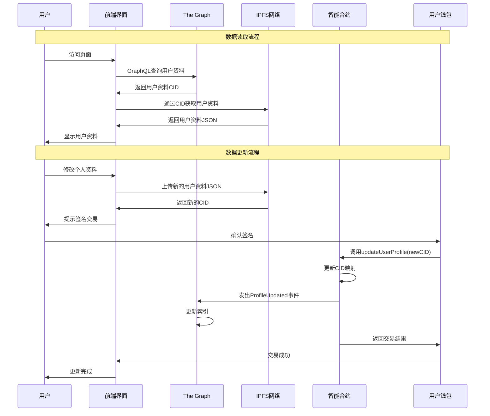

# HackX 去中心化架构：智能合约 + IPFS 实施策略

## 系统架构图

```mermaid
graph TB
    %% 用户层
    subgraph "用户层 (Frontend)"
        UI[用户界面]
        Wallet[钱包连接]
    end
    
    %% 智能合约层
    subgraph "智能合约层 (区块链)"
        SC[HackXPlatform 智能合约]
        SC --> |存储CID映射| CID_Mapping[CID映射存储]
        SC --> |发出事件| Events[智能合约事件]
        
        subgraph "智能合约数据结构"
            UserProfiles[用户资料CID映射<br/>mapping(address => string)]
            ProjectData[项目数据CID映射<br/>mapping(uint256 => string)]
            HackathonData[黑客松数据CID映射<br/>mapping(uint256 => string)]
            Relationships[关系映射<br/>mapping(uint256 => mapping(address => string))]
        end
        
        CID_Mapping --> UserProfiles
        CID_Mapping --> ProjectData
        CID_Mapping --> HackathonData
        CID_Mapping --> Relationships
    end
    
    %% IPFS层
    subgraph "IPFS存储层"
        IPFS[IPFS网络]
        
        subgraph "IPFS数据存储"
            UserJSON[用户资料JSON<br/>CID: QmUser...]
            ProjectJSON[项目数据JSON<br/>CID: QmProject...]
            HackathonJSON[黑客松数据JSON<br/>CID: QmHackathon...]
            CodeFiles[代码文件<br/>CID: QmCode...]
            MediaFiles[媒体文件<br/>CID: QmMedia...]
        end
        
        IPFS --> UserJSON
        IPFS --> ProjectJSON
        IPFS --> HackathonJSON
        IPFS --> CodeFiles
        IPFS --> MediaFiles
    end
    
    %% The Graph层
    subgraph "The Graph索引层"
        TG[The Graph服务]
        GraphQL[GraphQL API]
        
        subgraph "索引数据"
            UserIndex[用户索引]
            ProjectIndex[项目索引]
            HackathonIndex[黑客松索引]
            SearchIndex[搜索索引]
        end
        
        TG --> GraphQL
        TG --> UserIndex
        TG --> ProjectIndex
        TG --> HackathonIndex
        TG --> SearchIndex
    end
    
    %% 网关层
    subgraph "网关服务"
        IPFS_Gateway[IPFS网关<br/>ipfs.io/pinata.cloud]
        RPC_Node[RPC节点<br/>Infura/Alchemy]
    end
    
    %% 连接关系
    UI --> Wallet
    Wallet --> SC
    UI --> GraphQL
    GraphQL --> TG
    TG --> |监听| Events
    UI --> IPFS_Gateway
    IPFS_Gateway --> IPFS
    SC --> |调用| RPC_Node
    
    %% 数据流
    UI -.-> |1. 查询数据| GraphQL
    GraphQL -.-> |2. 返回CID| UI
    UI -.-> |3. 获取数据| IPFS_Gateway
    IPFS_Gateway -.-> |4. 返回文件| UI
    
    UI -.-> |5. 更新数据| IPFS_Gateway
    IPFS_Gateway -.-> |6. 返回新CID| UI
    UI -.-> |7. 调用合约| Wallet
    Wallet -.-> |8. 更新映射| SC
    SC -.-> |9. 发出事件| Events
    Events -.-> |10. 更新索引| TG
    
    %% 样式
    classDef userLayer fill:#e1f5fe
    classDef contractLayer fill:#f3e5f5
    classDef ipfsLayer fill:#e8f5e8
    classDef graphLayer fill:#fff3e0
    classDef gatewayLayer fill:#fce4ec
    
    class UI,Wallet userLayer
    class SC,CID_Mapping,Events,UserProfiles,ProjectData,HackathonData,Relationships contractLayer
    class IPFS,UserJSON,ProjectJSON,HackathonJSON,CodeFiles,MediaFiles ipfsLayer
    class TG,GraphQL,UserIndex,ProjectIndex,HackathonIndex,SearchIndex graphLayer
    class IPFS_Gateway,RPC_Node gatewayLayer
```

## 数据流程图



## 核心问题回顾

你提出的三个问题是构建去中心化应用的关键，Gemini 的回答非常精准，我们将其核心思想作为我们新架构的基石：

1.  **数据关系**: 如何在 IPFS 中找到数据关系？
    *   **答案**: **使用智能合约作为“关系层”或“索引数据库”**。通过智能合约内的 `mapping` 结构，建立不同数据 CID 之间的逻辑关联。

2.  **CID 存储**: 上传文件得到的 CID 存储在哪里？
    *   **答案**: **智能合约是存储 CID 的核心位置**。这确保了索引的公开可信、不可篡改和去中心化。

3.  **内容更新**: IPFS 内容无法更改，如何更新信息？
    *   **答案**: **不“修改”旧数据，而是“创建”新数据，并“更新”智能合约中的指针**。每次更新都会产生一个新的 CID，智能合约只需将索引指向最新的 CID 即可，从而保留了所有操作的完整历史记录。

## 新的核心架构理念

我们的系统将由三个核心部分组成，它们的分工清晰明确：

1.  **智能合约 (大脑 / 索引层)**
    *   **角色**: 整个平台的“真理来源 (Source of Truth)”。它不存储大的数据文件。
    *   **功能**:
        *   存储并管理所有关键数据（用户、项目、黑客松等）最新版本的 IPFS CID 指针。
        *   定义数据之间的核心关系（例如：哪个用户提交了哪个项目到哪个黑客松）。
        *   处理所有状态变更的逻辑（例如：更新个人资料、提交项目）。所有写操作都必须通过调用智能合约的函数来完成。

2.  **IPFS (硬盘 / 存储层)**
    *   **角色**: 一个去中心化的、只写一次的“硬盘”。
    *   **功能**:
        *   负责永久、安全地存储所有数据“快照”，包括 JSON 文件、代码、视频、图片等。
        *   通过 CID 保证每个数据快照的唯一性和不可篡改性。

3.  **The Graph (查询加速器 / 索引服务)**
    *   **角色**: 高效的去中心化索引和查询层。
    *   **功能**:
        *   监听智能合约发出的事件（Events）。每当智能合约状态发生变化时（例如，一个新项目被提交），它会发出一个事件。
        *   The Graph 会捕捉这些事件，并将数据处理后存入自己的索引中。
        *   提供一个高性能的 GraphQL API，让前端应用可以快速、复杂地查询数据，而无需直接与智能合约进行昂贵和缓慢的读取操作。

## 具体工作流程示例：更新用户个人资料

让我们用这个新架构来重新梳理一下“更新用户个人资料”的完整流程：

1.  **前端加载数据**:
    *   前端应用向 The Graph 发送一个 GraphQL 查询，请求获取用户 A 的当前个人资料。
    *   The Graph 快速返回用户 A 最新资料的 IPFS CID。
    *   前端应用通过 IPFS 网关（如 `ipfs.io` 或 Pinata）下载该 CID 对应的 JSON 文件，并在界面上显示出来。

2.  **用户修改信息**:
    *   用户 A在前端界面上修改了他的个人简介。
    *   前端应用根据修改后的信息，在本地创建一个**全新的** JSON 文件。

3.  **上传新版本**:
    *   前端将这个全新的 JSON 文件上传到 IPFS，获得一个**全新的 CID**，我们称之为 `CID_v2`。

4.  **调用智能合约更新指针**:
    *   前端应用提示用户 A 使用其钱包（如 MetaMask）签名一笔交易。
    *   这笔交易会调用 `HackXPlatform` 智能合约的 `updateUserProfile(string newCID)` 函数，并将 `CID_v2`作为参数传入。

5.  **智能合约处理状态变更**:
    *   `updateUserProfile` 函数会验证调用者是否是用户 A 本人。
    *   验证通过后，智能合约会更新内部的 `mapping`，将用户 A 地址对应的 CID 从旧的 `CID_v1` 更新为新的 `CID_v2`。
    *   **关键一步**: 智能合约在更新成功后，会发出一个 `ProfileUpdated(address user, string newCID)` 事件。

6.  **The Graph 索引更新**:
    *   The Graph 服务一直在监听 `ProfileUpdated` 事件。
    *   当监听到这个事件后，The Graph 会立即更新自己的索引，记录用户 A 的最新 CID 现在是 `CID_v2`。

7.  **完成**: 下一次任何应用查询用户 A 的资料时，都会从 The Graph 开始，直接获取到最新的 `CID_v2`。

## 架构对比与优势

| 特性 | 旧方案 (PostgreSQL + IPFS) | **新方案 (智能合约 + IPFS + The Graph)** | 优势 |
| :--- | :--- | :--- | :--- |
| **去中心化程度** | 混合型 (部分中心化) | **完全去中心化** | 消除了单点故障和信任风险 |
| **数据可验证性** | 不可公开验证 | **完全公开可验证** | 任何人都可以通过区块链浏览器审计数据索引 |
| **历史可追溯性**| 依赖数据库日志 | **链上不可变历史** | 所有版本的变更都有永久、防篡改的记录 |
| **查询性能** | 高 (SQL) | **高 (GraphQL)** | The Graph 解决了链上查询慢的问题 |
| **开发复杂性** | 偏向 Web2 | 偏向 Web3，更复杂 | 需要智能合约和 dApp 开发经验 |
| **运营成本** | 服务器 + 数据库成本 | **交易 Gas 费** + The Graph 服务费 | 成本模型不同，可通过 Layer 2 优化 |

### 如何解决新架构的挑战？

*   **高昂的 Gas 费**: 将智能合约部署在 Gas 费用更低的 Layer 2 网络（如 Arbitrum, Optimism）或高性能侧链（如 Polygon）上，可以极大地降低用户的操作成本。
*   **查询的局限性**: The Graph 完美地解决了这个问题，它已成为去中心化应用查询数据的标准解决方案。

## 总结

你提供的思路是完全正确的。**“智能合约 + IPFS”** 的组合是构建真正去中心化应用的基础，而引入 **The Graph** 则解决了其在实际应用中的查询性能瓶颈。

这个新的三层架构（**智能合约**负责状态和索引，**IPFS** 负责存储，**The Graph** 负责查询）不仅完全满足 HackX 的硬性要求，而且是一个技术上更先进、更具扩展性、真正面向未来的 Web3 架构。

我们将以此为基础进行后续的开发。 