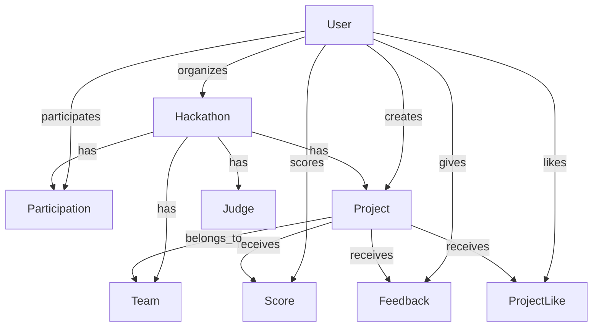

# HackX 项目 Prisma 使用指南

## 📋 概述

HackX 项目使用 Prisma 作为 ORM（对象关系映射）工具，用于管理 PostgreSQL 数据库。Prisma 提供了类型安全的数据库操作、自动生成的客户端、以及强大的查询功能。

## 🏗️ 项目架构

### 1. **Prisma 配置文件**

#### `prisma/schema.prisma` - 核心配置文件
```prisma
// 生成器配置
generator client {
  provider = "prisma-client-js"
}

// 数据源配置
datasource db {
  provider = "postgresql"
  url      = env("DATABASE_URL")
}

// 数据模型定义
model User {
  id        String   @id @default(cuid())
  email     String   @unique
  username  String?  @unique
  // ... 其他字段
  
  // 关系定义
  organizedHackathons Hackathon[] @relation("Organizer")
  participations      Participation[]
  // ... 其他关系
}
```

#### `lib/prisma.ts` - 客户端实例
```typescript
import { PrismaClient } from '@prisma/client'

const globalForPrisma = globalThis as unknown as {
  prisma: PrismaClient | undefined
}

export const prisma = globalForPrisma.prisma ?? new PrismaClient()

if (process.env.NODE_ENV !== 'production') globalForPrisma.prisma = prisma
```

## 🗄️ 数据模型详解

### 1. **核心模型关系**



### 2. **模型字段类型**

#### 基础类型
```prisma
model Example {
  id          String   @id @default(cuid())    // 主键，自动生成
  email       String   @unique                 // 唯一字段
  username    String?  @unique                 // 可选唯一字段
  age         Int      @default(18)            // 整数，默认值
  score       Decimal  @db.Decimal(3,1)        // 小数类型
  isActive    Boolean  @default(true)          // 布尔值
  createdAt   DateTime @default(now())         // 时间戳
  updatedAt   DateTime @updatedAt              // 自动更新时间
  metadata    Json     @default("{}")          // JSON 字段
}
```

#### 关系类型
```prisma
model User {
  id        String   @id @default(cuid())
  
  // 一对多关系
  projects  Project[]
  
  // 多对一关系
  team      Team?    @relation(fields: [teamId], references: [id])
  teamId    String?
  
  // 多对多关系（通过中间表）
  participations Participation[]
}

model Project {
  id        String   @id @default(cuid())
  
  // 多对一关系
  creator   User     @relation(fields: [creatorId], references: [id], onDelete: Cascade)
  creatorId String
  
  // 一对多关系
  scores    Score[]
  feedback  Feedback[]
}
```

## 🛠️ Prisma 操作详解

### 1. **基础 CRUD 操作**

#### 创建记录 (Create)
```typescript
// 创建单个用户
const user = await prisma.user.create({
  data: {
    email: 'alice@example.com',
    username: 'alice_dev',
    password: 'hashed_password',
    bio: '全栈开发者'
  }
})

// 创建黑客松（包含关系）
const hackathon = await prisma.hackathon.create({
  data: {
    title: 'Web3 创新挑战赛',
    description: '构建下一代去中心化应用',
    startDate: new Date('2024-03-15'),
    endDate: new Date('2024-03-17'),
    organizerId: user.id,
    categories: ['DeFi', 'NFT', 'DAO'],
    tags: ['Web3', '区块链'],
    maxParticipants: 200,
    prizePool: 50000.00
  },
  include: {
    organizer: true
  }
})

// 批量创建
const users = await prisma.user.createMany({
  data: [
    { email: 'user1@example.com', username: 'user1' },
    { email: 'user2@example.com', username: 'user2' },
    { email: 'user3@example.com', username: 'user3' }
  ]
})
```

#### 查询记录 (Read)
```typescript
// 查询单个用户
const user = await prisma.user.findUnique({
  where: { id: 'user_id' },
  include: {
    participations: {
      include: {
        hackathon: true
      }
    },
    projects: true
  }
})

// 查询多个用户（带筛选）
const users = await prisma.user.findMany({
  where: {
    emailVerified: true,
    reputationScore: {
      gte: 50
    }
  },
  select: {
    id: true,
    username: true,
    email: true,
    reputationScore: true,
    _count: {
      select: {
        projects: true,
        participations: true
      }
    }
  },
  orderBy: {
    reputationScore: 'desc'
  },
  take: 10,
  skip: 0
})

// 复杂查询
const hackathons = await prisma.hackathon.findMany({
  where: {
    AND: [
      { isPublic: true },
      { startDate: { gte: new Date() } },
      {
        OR: [
          { featured: true },
          { 
            participations: {
              some: {
                user: {
                  reputationScore: { gte: 80 }
                }
              }
            }
          }
        ]
      }
    ]
  },
  include: {
    organizer: {
      select: {
        id: true,
        username: true,
        avatarUrl: true
      }
    },
    _count: {
      select: {
        participations: true,
        projects: true
      }
    }
  }
})
```

#### 更新记录 (Update)
```typescript
// 更新单个记录
const updatedUser = await prisma.user.update({
  where: { id: 'user_id' },
  data: {
    username: 'new_username',
    bio: '更新的个人简介',
    reputationScore: {
      increment: 10
    }
  }
})

// 更新多个记录
const updatedUsers = await prisma.user.updateMany({
  where: {
    emailVerified: false,
    createdAt: {
      lt: new Date(Date.now() - 7 * 24 * 60 * 60 * 1000) // 7天前
    }
  },
  data: {
    emailVerified: true
  }
})

// 条件更新
const user = await prisma.user.update({
  where: { id: 'user_id' },
  data: {
    reputationScore: {
      increment: 1
    }
  }
})
```

#### 删除记录 (Delete)
```typescript
// 删除单个记录
const deletedUser = await prisma.user.delete({
  where: { id: 'user_id' }
})

// 删除多个记录
const deletedUsers = await prisma.user.deleteMany({
  where: {
    emailVerified: false,
    createdAt: {
      lt: new Date(Date.now() - 30 * 24 * 60 * 60 * 1000) // 30天前
    }
  }
})
```

### 2. **关系操作**

#### 创建关系
```typescript
// 创建用户并同时创建参与记录
const participation = await prisma.participation.create({
  data: {
    user: {
      connect: { id: 'user_id' }
    },
    hackathon: {
      connect: { id: 'hackathon_id' }
    },
    status: 'registered'
  },
  include: {
    user: true,
    hackathon: true
  }
})

// 创建项目并关联团队
const project = await prisma.project.create({
  data: {
    title: 'DeFi Yield Optimizer',
    description: '智能收益优化平台',
    hackathon: {
      connect: { id: 'hackathon_id' }
    },
    creator: {
      connect: { id: 'user_id' }
    },
    team: {
      connect: { id: 'team_id' }
    },
    technologies: ['Solidity', 'React', 'Node.js'],
    tags: ['DeFi', '收益优化']
  }
})
```

#### 查询关系
```typescript
// 查询用户的所有项目
const userWithProjects = await prisma.user.findUnique({
  where: { id: 'user_id' },
  include: {
    projects: {
      include: {
        hackathon: true,
        scores: {
          include: {
            judge: true
          }
        }
      }
    }
  }
})

// 查询黑客松的所有参与者
const hackathonWithParticipants = await prisma.hackathon.findUnique({
  where: { id: 'hackathon_id' },
  include: {
    participations: {
      include: {
        user: {
          select: {
            id: true,
            username: true,
            avatarUrl: true,
            reputationScore: true
          }
        }
      }
    }
  }
})
```

### 3. **高级查询功能**

#### 聚合查询
```typescript
// 统计用户活跃度
const userStats = await prisma.user.aggregate({
  _count: {
    id: true
  },
  _avg: {
    reputationScore: true
  },
  _max: {
    reputationScore: true
  },
  _min: {
    reputationScore: true
  },
  _sum: {
    reputationScore: true
  }
})

// 按黑客松统计项目数量
const projectStats = await prisma.hackathon.groupBy({
  by: ['id', 'title'],
  _count: {
    projects: true
  },
  _avg: {
    _count: {
      participations: true
    }
  },
  having: {
    projects: {
      _count: {
        gt: 5
      }
    }
  }
})
```

#### 原生 SQL 查询
```typescript
// 执行原生 SQL
const results = await prisma.$queryRaw`
  SELECT 
    h.title,
    COUNT(DISTINCT p.user_id) as participant_count,
    COUNT(DISTINCT pr.id) as project_count,
    AVG(s.total_score) as average_score
  FROM hackathons h
  LEFT JOIN participations p ON h.id = p.hackathon_id
  LEFT JOIN projects pr ON h.id = pr.hackathon_id
  LEFT JOIN scores s ON pr.id = s.project_id
  WHERE h.start_date >= $1
  GROUP BY h.id, h.title
  ORDER BY participant_count DESC
`

// 执行事务
const result = await prisma.$transaction(async (tx) => {
  // 创建黑客松
  const hackathon = await tx.hackathon.create({
    data: {
      title: '新黑客松',
      description: '描述',
      startDate: new Date(),
      endDate: new Date(),
      organizerId: 'user_id'
    }
  })
  
  // 创建参与记录
  const participation = await tx.participation.create({
    data: {
      hackathonId: hackathon.id,
      userId: 'user_id',
      status: 'registered'
    }
  })
  
  return { hackathon, participation }
})
```

### 4. **IPFS 相关查询**

#### 查询 IPFS 数据
```typescript
// 查询所有 IPFS 存储的数据
const ipfsData = await prisma.$queryRaw`
  SELECT 'users' as table_name, id, ipfs_profile_hash as ipfs_hash
  FROM users 
  WHERE ipfs_profile_hash IS NOT NULL
  UNION ALL
  SELECT 'hackathons' as table_name, id, ipfs_hash
  FROM hackathons 
  WHERE ipfs_hash IS NOT NULL
  UNION ALL
  SELECT 'scores' as table_name, id, ipfs_hash
  FROM scores 
  WHERE ipfs_hash IS NOT NULL
  UNION ALL
  SELECT 'feedback' as table_name, id, ipfs_hash
  FROM feedback 
  WHERE ipfs_hash IS NOT NULL
  UNION ALL
  SELECT 'project_likes' as table_name, id, ipfs_hash
  FROM project_likes 
  WHERE ipfs_hash IS NOT NULL
`

// 查询特定项目的 IPFS 数据
const projectWithIPFS = await prisma.project.findUnique({
  where: { id: 'project_id' },
  select: {
    id: true,
    title: true,
    ipfsHash: true,
    scores: {
      where: {
        ipfsHash: { not: null }
      },
      select: {
        id: true,
        ipfsHash: true,
        judge: {
          select: {
            username: true
          }
        }
      }
    },
    feedback: {
      where: {
        ipfsHash: { not: null }
      },
      select: {
        id: true,
        ipfsHash: true,
        rating: true
      }
    }
  }
})
```

## 🔧 Prisma CLI 使用

### 1. **开发命令**
```bash
# 生成 Prisma 客户端
npx prisma generate

# 查看数据库状态
npx prisma studio

# 创建迁移
npx prisma migrate dev --name add_ipfs_fields

# 应用迁移到生产环境
npx prisma migrate deploy

# 重置数据库（开发环境）
npx prisma migrate reset

# 推送架构变更（不创建迁移）
npx prisma db push

# 拉取数据库架构
npx prisma db pull
```

### 2. **数据库管理**
```bash
# 查看迁移状态
npx prisma migrate status

# 查看数据库架构
npx prisma db pull

# 验证架构
npx prisma validate

# 格式化 schema 文件
npx prisma format
```

## 📊 性能优化

### 1. **查询优化**
```typescript
// 使用 select 只获取需要的字段
const users = await prisma.user.findMany({
  select: {
    id: true,
    username: true,
    email: true,
    // 不选择 password 等敏感字段
  }
})

// 使用 include 预加载关系
const hackathons = await prisma.hackathon.findMany({
  include: {
    organizer: {
      select: {
        id: true,
        username: true
      }
    },
    _count: {
      select: {
        participations: true,
        projects: true
      }
    }
  }
})

// 使用 take 和 skip 进行分页
const projects = await prisma.project.findMany({
  take: 10,
  skip: 20, // 跳过前20条
  orderBy: {
    createdAt: 'desc'
  }
})
```

### 2. **批量操作**
```typescript
// 批量创建
const users = await prisma.user.createMany({
  data: [
    { email: 'user1@example.com', username: 'user1' },
    { email: 'user2@example.com', username: 'user2' },
    // ... 更多用户
  ],
  skipDuplicates: true // 跳过重复记录
})

// 批量更新
const result = await prisma.user.updateMany({
  where: {
    emailVerified: false
  },
  data: {
    emailVerified: true
  }
})

// 批量删除
const deleted = await prisma.notification.deleteMany({
  where: {
    createdAt: {
      lt: new Date(Date.now() - 30 * 24 * 60 * 60 * 1000)
    }
  }
})
```

## 🔒 安全最佳实践

### 1. **输入验证**
```typescript
// 使用 Zod 验证输入
import { z } from 'zod'

const createUserSchema = z.object({
  email: z.string().email(),
  username: z.string().min(3).max(20),
  password: z.string().min(8)
})

// 在 API 路由中使用
export async function POST(request: NextRequest) {
  const body = await request.json()
  const validatedData = createUserSchema.parse(body)
  
  const user = await prisma.user.create({
    data: validatedData
  })
}
```

### 2. **事务处理**
```typescript
// 使用事务确保数据一致性
const result = await prisma.$transaction(async (tx) => {
  // 创建黑客松
  const hackathon = await tx.hackathon.create({
    data: hackathonData
  })
  
  // 上传到 IPFS
  const ipfsHash = await uploadToIPFS(hackathonData)
  
  // 更新 IPFS 哈希
  const updatedHackathon = await tx.hackathon.update({
    where: { id: hackathon.id },
    data: { ipfsHash }
  })
  
  return updatedHackathon
})
```

### 3. **错误处理**
```typescript
try {
  const user = await prisma.user.create({
    data: userData
  })
} catch (error) {
  if (error instanceof Prisma.PrismaClientKnownRequestError) {
    if (error.code === 'P2002') {
      // 唯一约束冲突
      throw new Error('用户已存在')
    }
  }
  throw error
}
```

## 📈 监控和调试

### 1. **查询日志**
```typescript
// 启用查询日志
const prisma = new PrismaClient({
  log: ['query', 'info', 'warn', 'error'],
})
```

### 2. **性能监控**
```typescript
// 测量查询性能
const startTime = Date.now()
const users = await prisma.user.findMany()
const endTime = Date.now()
console.log(`查询耗时: ${endTime - startTime}ms`)
```

## 🔄 版本管理

### 1. **迁移管理**
```bash
# 创建迁移
npx prisma migrate dev --name add_new_field

# 查看迁移历史
npx prisma migrate status

# 回滚迁移（谨慎使用）
npx prisma migrate reset
```

### 2. **架构变更**
```prisma
// 添加新字段
model User {
  id        String   @id @default(cuid())
  email     String   @unique
  username  String?  @unique
  // 新增字段
  phone     String?  @unique
  address   String?
}
```

---

**注意**: 在生产环境中使用 Prisma 时，请确保：
1. 使用连接池管理数据库连接
2. 实施适当的错误处理和重试机制
3. 监控查询性能
4. 定期备份数据库
5. 使用事务确保数据一致性 